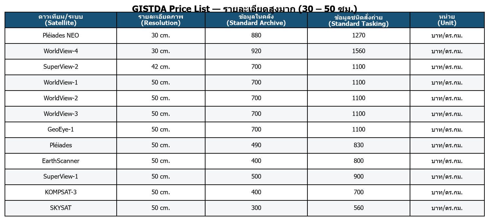
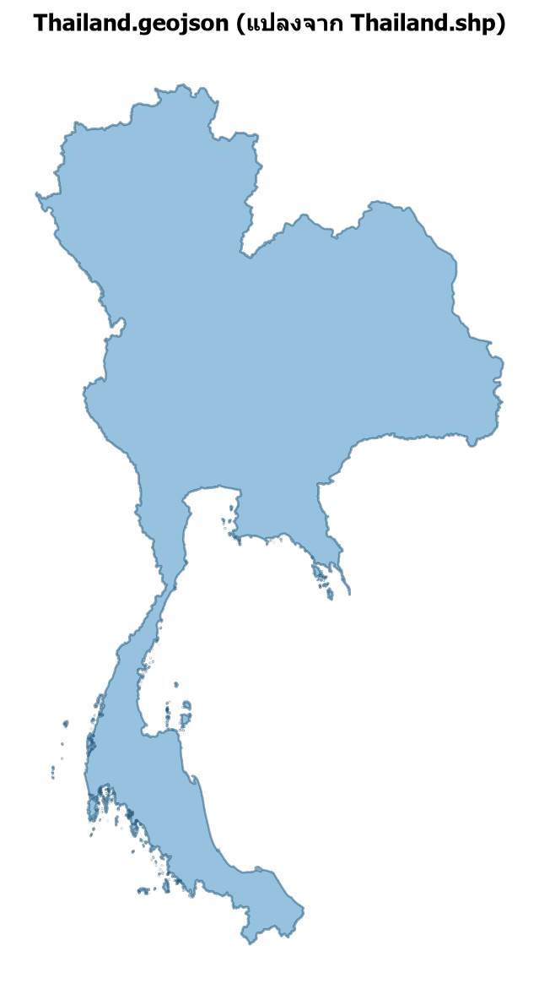

<div align="center">

# 🛰️ GEOAI

**เครื่องมือแปลงข้อมูลดาวเทียมและ GIS อัตโนมัติด้วย Python**


</div>

---

## 📌 โปรเจกต์นี้ทำอะไรบ้าง

1. **แปลงราคาข้อมูลดาวเทียม GISTDA** — ดึงตารางราคาจากไฟล์ PDF ของ GISTDA มาแปลงเป็น CSV / XLSX / HTML
2. **แปลงไฟล์ GIS** — แปลง Shapefile ขอบเขตประเทศไทยเป็น GeoJSON และสร้างแผนที่ Interactive บน Google Maps

---

## 🗂️ ส่วนที่ 1: GISTDA Satellite Price List

แปลงไฟล์ PDF ราคาข้อมูลจากดาวเทียมของ [GISTDA](https://www.gistda.or.th) ให้เป็น CSV, XLSX และ HTML โดยอัตโนมัติ

**ที่มา:** [Gistda_Price_List.pdf](https://www.gistda.or.th/download/Gistda_Price_List.pdf) — ราคาดาวเทียม Optical (30 ซม. – มากกว่า 2 เมตร) และเรดาร์ (SAR) รวม 64 รายการ

| ไฟล์ | รายละเอียด |
|---|---|
| [`Gistda_Price_List.csv`](Gistda_Price_List.csv) | ตารางเดียว long-format แยกคอลัมน์ ประเภทข้อมูล / ดาวเทียม/ระบบ / โหมด / ราคา |
| [`Gistda_Price_List.xlsx`](Gistda_Price_List.xlsx) | แยก sheet ตามหมวดหมู่ (4 หมวด) |
| [`Gistda_Price_List.html`](Gistda_Price_List.html) | หน้าเว็บแสดงตารางราคา แยกหมวดหมู่พร้อมสไตล์ |

<div align="center">



</div>

**หมวดหมู่ข้อมูล**

1. รายละเอียดสูงมาก (30 – 50 ซม.) — เช่น Pléiades NEO, WorldView-4
2. รายละเอียดสูง (60 ซม. – 2 ม.) — เช่น QuickBird, SPOT-6/7, ไทยโชต
3. รายละเอียดปานกลาง (มากกว่า 2 เมตร) — LANDSAT, PLANETSCOPE
4. ระบบเรดาร์ (SAR) — RADARSAT-2, TerraSAR X, COSMO SkyMed, GaoFen-3

### วิธีใช้

```bash
# 1. ติดตั้ง environment
python -m venv .venv
.venv\Scripts\activate      # Windows
pip install -r requirements.txt

# 2. ดาวน์โหลดไฟล์ PDF ต้นฉบับ
curl -o Gistda_Price_List.pdf https://www.gistda.or.th/download/Gistda_Price_List.pdf

# 3. รันสคริปต์แปลงไฟล์
python convert_price_list.py
```

จะได้ไฟล์ `Gistda_Price_List.csv`, `.xlsx`, `.html` ในโฟลเดอร์เดียวกัน

---

## 🗺️ ส่วนที่ 2: GIS — Shapefile → GeoJSON → แผนที่ Interactive

แปลง `Thailand.shp` เป็น `Thailand.geojson` (reproject เป็น WGS84) แล้วสร้างแผนที่ Interactive ซ้อนทับ Google Maps

| ไฟล์ | รายละเอียด |
|---|---|
| [`Example/Thailand.geojson`](Example/Thailand.geojson) | ขอบเขตประเทศไทย ระบบพิกัด WGS84 (EPSG:4326) |
| [`Example/Thailand.html`](Example/Thailand.html) | แผนที่ Interactive สลับ Google Maps Roadmap / Satellite ได้ |
| [`Example/make_thailand_map.py`](Example/make_thailand_map.py) | สคริปต์สร้างแผนที่ |

<div align="center">



</div>

### วิธีใช้

```bash
cd Example
python -c "
import geopandas as gpd
gdf = gpd.read_file('Thailand.shp').to_crs(epsg=4326)
gdf.to_file('Thailand.geojson', driver='GeoJSON')
"
python make_thailand_map.py
```

จะได้ `Thailand.geojson` และ `Thailand.html` (เปิดด้วยเบราว์เซอร์เพื่อดูแผนที่ Interactive)

---

## 📁 โครงสร้างโปรเจกต์

```
GEOAI/
├── Gistda_Price_List.pdf        # ไฟล์ต้นฉบับจาก GISTDA
├── convert_price_list.py        # สคริปต์แปลง PDF -> CSV/XLSX/HTML
├── Gistda_Price_List.csv
├── Gistda_Price_List.xlsx
├── Gistda_Price_List.html
├── make_preview_image.py        # สคริปต์สร้างภาพตัวอย่างสำหรับ README
├── requirements.txt
├── docs/
│   ├── preview.png
│   └── thailand_preview.png
└── Example/
    ├── Thailand.shp              # shapefile ต้นฉบับ
    ├── Thailand.geojson          # แปลงแล้ว (WGS84)
    ├── Thailand.html             # แผนที่ Interactive
    ├── make_thailand_map.py
    └── POI.csv
```

---

<div align="center">

สร้างด้วย 🐍 Python · pandas · geopandas · folium

📍 อยากรู้เรื่อง GIS และข้อมูลเชิงพื้นที่เพิ่มเติม? ติดตามที่ **PORTHA Channel**
[คลิกที่นี่](https://www.youtube.com/watch?v=8or7MoUCQHY&list=PLh1MlD0Zdj-B_-GZN4WCCY3BKwhWuD5hH)

</div>
